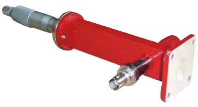

### Introduction

1.  **Circulator:**  
    A circulator is a device that transports radio frequency or microwave signals from one port to another. They typically have three ports. They are made of magnets and ferrite materials with magnetic properties. Circulators can be made to circulate clockwise or counterclockwise. So the name "circulator" makes sense in that it transmits the signal around to the three ports. These devices are also referred to as duplexers because they allow the transmission of two signals over one channel. This allows a receiver and a transmitter to share the same antenna. This is the most common use for a circulator. When the transmitter sends a signal, the device directs the signal to the antenna port. So in summary, a circulator is a device that is designed to direct radio frequencies or microwave signals from Port 1 to Port 2 with a minimum loss.
  
    

    

    **Fig. 1 Circulator** 
 

2.  **Isolator:**  
    An isolator is a two-port device that transmits microwave or radio frequency power in one direction only. Due to internal behavior, the propagation in one direction is allowed while the other direction is blocked. The non-reprocity observed in these devices usually comes from the interaction between the propagating wave and the material, which can be different with respect to the direction of propagation. It is used to shield equipment on its input side, from the effects of conditions on its output side; for example, to prevent a microwave source being detuned by a mismatched load.
  
    

 
    

    **Fig. 2 Isolator** 
  

3.  **Attenuator:**  
    The attenuators are basically passive devices which control power levels in microwave system by absorption of the signal. Attenuator which attenuates the RF signal in a waveguide system is referred as waveguide attenuator. A waveguide attenuator works exactly opposite of an amplifier which increases the power of the signal without altering the waveform. They are achieved by insertion of resistive films.
    
    #### Types of Waveguide Attenuators:

    * Fixed Low Power Attenuator - Signal loss is constant and cannot be changed.
    * Fixed Low Power Precision Attenuator - Signal loss is fixed and high precision elements are used.
    * Fixed High Power Precision Attenuator- Precision elements yield optimum electrical performance at high power.
    * Continuously Variable Attenuator - Also known as CVA, where the signal loss can be changed using a mechanical adjustment screw, knob or dial.

    

 
    

    **Fig. 3 Attenuator** 
  

4.  **Directional Coupler:**  
    Directional couplers are passive devices used mostly in the field of radio technology. They couple a defined amount of the electromagnetic power in a transmission line to a port enabling the signal to be used in another circuit. An essential feature of directional couplers is that they only couple power flowing in one direction. Power entering the output port is coupled to the isolated port but not to the coupled port. A directional coupler designed to split power equally between two ports is called a hybrid coupler. Directional couplers are most frequently constructed from two coupled transmission lines set close enough together such that energy passing through one is coupled to the other. This technique is favoured at the microwave frequencies where transmission line designs are commonly used to implement many circuit elements.
  
    

  
    

    **Fig. 4 Directional Coupler**
 

5.  **Horn Antenna:**  
    A horn antenna or microwave horn is an antenna that consists of a flaring metal waveguide shaped like a horn to direct radio waves in a beam. Horns are widely used as antennas at UHF and microwave frequencies, above 300 MHz. They are used as feed antennas (called feed horns) for larger antenna structures such as parabolic antennas, as standard calibration antennas to measure the gain of other antennas, and as directive antennas for such devices as radar guns, automatic door openers, and microwave radiometers. Their advantages are moderate directivity , low standing wave ratio (SWR), broad bandwidth, and simple construction and adjustment.  
  
    

 
    

    **Fig. 5 Horn Antenna**
  

6.  **E-Plane TEE:**  
    An E-plane TEE is a waveguide tee in which the axis of side arm is parallel to the E field of the main guide. If the collinear arms are symmetric about the side arms, there are two arm characteristics. When wave are fed into the side arms, the wave appear in the collinear arms will be in opposite phase and in the same magnitude.
  
    

    

    **Fig. 6 E-Plane TEE**
   

7.  **H-Plane TEE:**  
    An H-Plane TEE is a waveguide TEE in which the axis of its side arm is shunting the E field or parallel to the H field of the main guide and attaching the another waveguide.
  
   

 
   

   **Fig. 7 H-Plane TEE**
  

8.  **Magic-Tee:**  
    A magic tee (or magic T or hybrid tee) is a hybrid or 3 dB coupler used in microwave systems. It is an alternative to the rat-race coupler. In contrast to the rat-race, the three-dimensional structure of the magic tee makes it less readily constructed in planar technologies such as microstrip or stripline. The magic comes from the way it prevents signals from propagating between certain ports under specific conditions. This allows it to be used as a duplexer; for instance, it can be used to isolate the transmitter and receiver in a radar system while sharing the antenna. In practical examples, it is used to both isolate circuits and mix signals, for instance in a COHO radar. It is a 4 port waveguide tee that is a combination of an E-Plane and H-Plane Waveguide Tee.
  
    

  
    

    **Fig. 8 Magic-Tee** 
 
    

9.  **Frequency Meter:**  
    It is constructed from cylindrical cavity resonator with a variable short circuit termination. The shorting plunger is used to change the resonance frequency of the cavity by changing the cavity length. DRF measures the frequency directly. It is particularly useful when measuring frequency differences of small changes.
  
    

    

    **Fig. 9 Frequency Meter**
   

10. **Pin Modulator:**  
    Pin Diode modulators offer an ideal way for amplitude and the pulse modulation of microwave signal through wide range of frequencies. These modulators utilize PIN Diode which are mounted across the waveguide line a R.F. isolated DC bias lead passing to an external TNC (F) Connectors. The PIN diode comprises a semiconductor diode having three layers naming the P-type layer, Intrinsic layer and N-type layer. The P and N regions are there, and the region between them consists of the intrinsic material, and the doping level is said to be very low in this region. The P region and the N-type regions are known to be heavily doped.

    

    

    **Fig. 10 Pin Modulator**
 

11. **Gunn Diode Oscillator:**  
    A Gunn Diode Oscillator (also known as Gunn oscillators or transferred electron device oscillators) is an inexpensive source of microwave power and comprises a Gunn diode or Transferred Electron Device (TED) as its major component. A diode is a semiconductor-based component that allows current to flow in only one direction. It has two terminals: anode and cathode. It acts as an electronic switch, exhibiting very low resistance in forward bias and very high resistance in reverse bias. Diodes are commonly used for rectification and signal switching purposes. It performs a similar function to Reflex Klystron Oscillators. In Gunn oscillators, the Gunn diode is placed in a resonant cavity.

    

    

    **Fig. 11 Gunn Oscillator**
 

12. **Power Meter:**  
    It is used to measure the power of electromagnetic signals, particularly in the microwave frequency range (typically from 100 MHz to 40 GHz). 
    
    Typically, a microwave power meter consists of a measuring head containing the power sensing element, connected via a cable to the meter itself, which displays the power reading. The head may also be referred to as a power sensor or mount. Different power sensors can be used for varying frequencies or power levels. Historically, in most power sensor and meter combinations, the sensor converted microwave power into an analog voltage, which the meter then read and displayed as a power reading.

    Modern power sensor heads often include electronics to produce a digital output and can connect via USB to a PC, which functions as the power meter.

     

         
       

    **Fig. 12 Power Meter**
    
    
 

14. **VSMR Meter:**  
    A VSWR meter basically consists of a high gain, high Q low noise voltage amplifier normally tuned at a fixed frequency at which the microwave signal is modulated. The VSWR meter uses the detector signal out of the microwave detector as its input, amplifies the same and provides the output on the calibrated volt meter. The meter itself can be calibrated in terms of VSWR.

     

    

    **Fig. 13 VSMR Meter**
 

